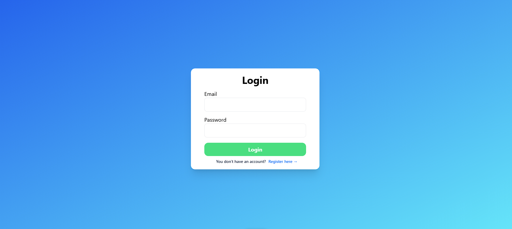
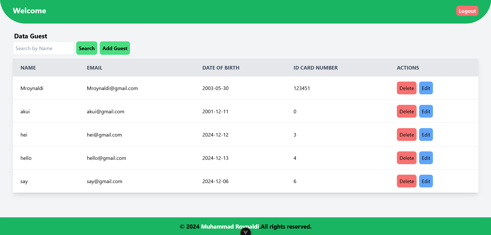
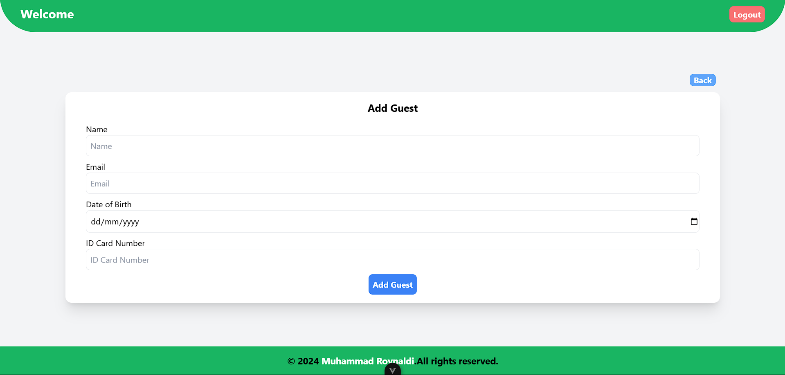
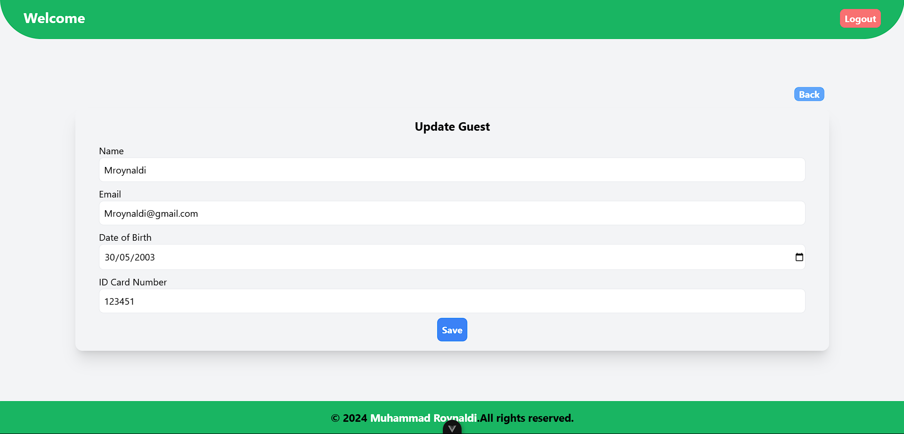

# Frontend - Vue
Project Technical Test Web Development Aksesmu (Guest Book).
## Fitur Utama
    1. Login User
    2. Register User
    3. Logout User
    4. Add data Guest
    5. Update data Guest
    6. Delete data Guest
    7. Show data Guest
    8. Search data Guest
## Prasyarat
Sebelum menjalankan proyek ini, pastikan kamu memiliki hal-hal berikut:

Node.js (versi terbaru yang stabil)
npm (atau yarn jika kamu memilih untuk menggunakan yarn).
Kemudian untuk styling-nya saya menggunakan TailwindCss. 

Untuk memverifikasi jika sudah terinstal, jalankan perintah berikut di terminal:
```bash
  node -v
  npm -v
```


## Cara Menjalankan Project FrontEnd

Clone repositori:

```bash
  git clone https://github.com/MRoynaldi-30/fe-vue.git
  cd fe-vue
```

Install dependencies:

```bash
  npm install
```

Jika kamu menggunakan yarn:
```bash
  yarn install
```
Menjalankan Projek:
```bash
  npm run dev
```


## ScreenShoot Projek
  ### Login Page

  ### Register Page

  ### Home Page

  ### Add Guest Page

  ### Update Guest Page



## Sekian dan Terima kasih